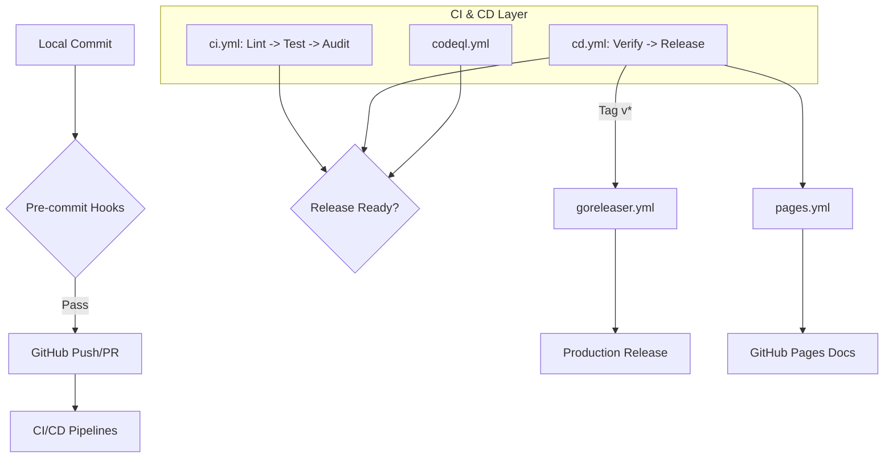

# GitHub Actions Workflows Guide

[English](README.md) | [简体中文](README_zh-CN.md)

This directory contains the automated CI/CD pipelines and repository maintenance tasks for the Snowdream Tech project.

## 1. Design & Architecture

### Overview

The GitHub Actions infrastructure provides a robust, multi-layered validation system that ensures every commit meets the project's high standards for quality, security, and performance.

### Key Capabilities

- **Automated Quality Gates**: Unified linting and security auditing on every PR.
- **Cross-Stack Testing**: Validation across Python, Node.js, Go, Shell, and PowerShell.
- **Continuous Delivery**: Automated versioning, changelog generation, and Pages deployment.
- **Resource Efficiency**: Intelligent caching and aggressive concurrency management.

### Architecture Diagram



### Design Principles

- **Auditable**: Every workflow run is traced with unique IDs and logged in the Actions tab.
- **Overridable**: Configurable via `workflow_dispatch` inputs and repository secrets.
- **Extensible**: Component-based YAML structures allow for easy addition of new language stacks.
- **Lean**: No unnecessary steps; specific path filters used to skip irrelevant runs.

### Responsibilities

- **CI Layer**: Owns code validation, formatting, and unit testing.
- **Security Layer**: Owns static analysis (CodeQL) and vulnerability scanning (Trivy).
- **CD Layer**: Owns release orchestration and artifact publishing.

## 2. Usage Guide

### Prerequisites

- A GitHub repository with Actions enabled.
- Correctly configured repository secrets (if using external integrations like Slack).
- Node.js (v24.1.0+) and Python (v3.12+) for local verification.

### Quick Start

1. Push a feature branch: `git push origin feat/my-feature`.
2. Open a Pull Request to `main`.
3. Monitor the status checks in the PR UI.
4. Address any failures reported by `lint` or `test` jobs.

### Configuration Reference

| Parameter | Type    | Default | Description                                            |
| :-------- | :------ | :------ | :----------------------------------------------------- |
| `venv`    | String  | `.venv` | Path to the Python virtual environment.                |
| `npm`     | Boolean | `true`  | Whether to use npm for Node.js dependency management.  |

### Workflow Patterns

- **PR Check Pattern**: Triggered on `pull_request` to validate incoming code.
- **Main Sync Pattern**: Triggered on `push` to `main` for release and deployment.
- **Maintenance Pattern**: Scheduled via `cron` for stale issue management and security scans.

### File Structure

```text
.github/workflows/
├── README.md           # This guide
├── README_zh-CN.md     # Chinese version
├── ci.yml              # Continuous Integration (Lint -> Test -> Audit)
├── cd.yml              # Continuous Delivery (Verify -> Release Please)
├── codeql.yml          # Deep security analysis
├── pages.yml           # Docs deployment
├── cache.yml           # Cache maintenance
├── labeler.yml         # PR categorization
├── stale.yml           # Issue management
├── goreleaser.yml      # Binary release automation
└── pr-title.yml        # Semantic title validation
```

## 3. Operations Guide

### Pre-deployment Checklist

1. Verify `actionlint` passes on all workflow changes.
2. Ensure `unirtm run verify` passes locally.
3. Check `GITHUB_TOKEN` permissions for new workflows.

### Performance Considerations

- **Caching**: Use `npm` and `pip` caching in every job to reduce build time by ~40%.
- **Matrix**: Limit test matrices to supported OS/version combinations to save runner minutes.

### Troubleshooting

- **Problem**: Workflow fails with "Resource not accessible by integration".
  - **Diagnosis**: Check the `permissions` block in the Job definition.
  - **Solution**: Grant the required scope (e.g., `contents: write`) at the job or workflow level.
- **Problem**: `lint` job fails on a specific file.
  - **Diagnosis**: Run `unirtm run lint` locally to identify the specific formatting or syntax error.
  - **Solution**: Fix the file and push the correction; CI will re-trigger automatically.
- **Problem**: `test` job times out.
  - **Diagnosis**: Review the logs to see if a specific test case is hanging.
  - **Solution**: Increase `timeout-minutes` or optimize the slow test case.

## 4. Security Considerations

### Security Model

- **Double-Zero Policy**: `permissions: {}` at root level to prevent accidental token misuse.
- **Job Isolation**: Each job runs in a clean, isolated environment.
- **OIDC Integration**: Uses OpenID Connect for cloud authentication where possible.

### Best Practices

| Aspect          | Requirement      | Implementation                                        |
| :-------------- | :--------------- | :---------------------------------------------------- |
| **Permissions** | Least Privilege  | Job-level `permissions` blocks.                       |
| **Secrets**     | No logging       | Passed via `env` variables, never echoed.             |
| **Injection**   | Sanitized inputs | Use `env` variables for `${{ github.event.* }}` data. |
| **Pinning**     | Stability        | Use `x.y.z` tags for all third-party actions.         |

## 5. Development Guide

### Contribution Requirements

- All new workflows MUST include a standard "World Class" header.
- **Naming Convention**: All steps MUST follow the `Emoji + Verb + Object` format (e.g., `📂 Checkout Repository Code`).
- **Technical Rationales**: Every non-trivial step MUST include a `# Why` comment explaining the technical rationale.
- **Versioning**: All actions MUST be pinned to exact `x.y.z` tags (e.g., `v6.0.2`); major version tags or SHAs are prohibited.
- Use `shell: sh` for cross-platform POSIX compliance.
- Keep English and Chinese READMEs in sync.

### Local Setup

1. Install `actionlint`: `brew install actionlint`.
2. Validate workflows: `actionlint .github/workflows/*.yml`.
3. Check project health: `unirtm run verify`.

### References

- [Official GitHub Actions Documentation](https://docs.github.com/en/actions)
- [Conventional Commits Specification](https://www.conventionalcommits.org/)
