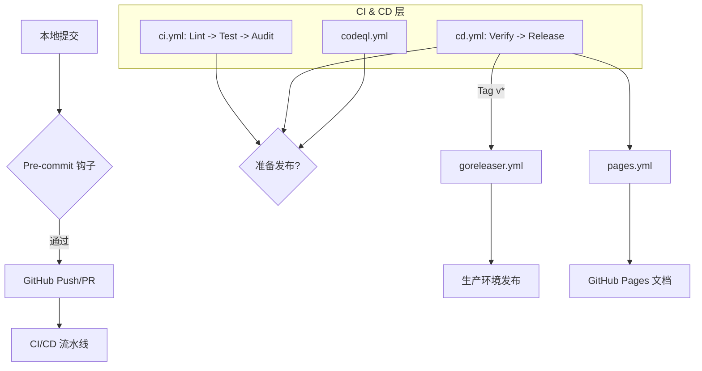

# GitHub Actions 工作流指南

[English](README.md) | [简体中文](README_zh-CN.md)

本目录包含了 Snowdream Tech 项目的自动化 CI/CD 流水线和仓库维护任务。

## 1. 设计与架构 (Design & Architecture)

### 概述

GitHub Actions 基础设施提供了一个健壮的多层验证系统，确保每一次提交都符合项目在质量、安全和性能方面的高标准。

### 核心能力

- **自动化质量门禁**：在每次 PR 时进行统一的代码校验和安全审计。
- **跨平台测试**：支持 Python、Node.js、Go、Shell 和 PowerShell 的多语言验证。
- **持续交付**：自动化版本管理、更新日志生成及文档部署。
- **资源效率**：通过智能缓存和高效的并发管理节省计算资源。

### 架构图



### 设计原则

- **可审计性**：每个工作流运行都有唯一 ID 追踪，并记录在 Actions 面板中。
- **可覆盖性**：可通过 `workflow_dispatch` 输入和仓库密钥进行灵活配置。
- **可扩展性**：基于组件的 YAML 结构，方便快速添加新的语言技术栈。
- **精简化**：无冗余步骤；使用路径过滤器跳过无关的运行。

### 职责范围

- **CI 层**：负责代码校验、格式化和项目验证。
- **安全层**：负责静态代码分析 (CodeQL) 和漏洞扫描 (Trivy)。
- **CD 层**：负责发布编排和产物发布。

## 2. 使用指南 (Usage Guide)

### 前提条件

- 启用了 Actions 的 GitHub 仓库。
- 正确配置的仓库密钥（如使用 Slack 等外部集成）。
- 用于本地验证的 Node.js (v24.1.0+) 和 Python (v3.12+)。

### 快速开始

1. 提交功能分支：`git push origin feat/my-feature`。
2. 向 `main` 分支发起 Pull Request。
3. 在 PR 界面监控状态检查。
4. 修复 `lint` 或 `test` 任务报告的任何错误。

### 配置参考

| 参数   | 类型    | 默认值  | 描述                                  |
| :----- | :------ | :------ | :------------------------------------ |
| `venv` | String  | `.venv` | Python 虚拟环境路径。                 |
| `npm`  | Boolean | `true`  | 是否使用 npm 进行 Node.js 依赖管理。  |

### 工作流模式

- **PR 校验模式**：在 `pull_request` 时触发，验证新代码质量。
- **主分支同步模式**：在推送到 `main` 时触发，负责发布和部署。
- **定期维护模式**：通过 `cron` 定期运行，处理过期 Issue 和安全扫描。

### 目录结构

```text
.github/workflows/
├── README.md           # 英文指南
├── README_zh-CN.md     # 中文指南（本文档）
├── ci.yml              # Continuous Integration (统一 CI)
├── cd.yml              # Continuous Delivery (统一 CD)
├── codeql.yml          # 深度安全分析
├── pages.yml           # 文档部署
├── cache.yml           # 缓存清理维护
├── labeler.yml         # PR 自动分类
├── stale.yml           # Issue 维护管理
├── goreleaser.yml      # 二进制发布自动化
└── pr-title.yml        # 语义化标题校验
```

## 3. 运维指南 (Operations Guide)

### 发布前检查清单

1. 确保所有工作流变更均通过 `actionlint` 校验。
2. 确保 `unirtm run verify` 在本地运行通过。
3. 检查新工作流的 `GITHUB_TOKEN` 权限。

### 性能考量

- **缓存应用**：在每个任务中使用 `npm` 和 `pip` 缓存，可减少约 40% 的构建时间。
- **矩阵测试**：将测试矩阵限制在支持的 OS/版本组合中，以节省运行配额。

### 故障排查

- **问题**：工作流报错 "Resource not accessible by integration"。
  - **诊断**：检查 Job 定义中的 `permissions` 块。
  - **解决方案**：在 Job 或工作流级别授予所需的权限作用域（如 `contents: write`）。
- **问题**：`lint` 任务在特定文件上失败。
  - **诊断**：本地运行 `unirtm run lint` 以定位具体的格式或语法错误。
  - **解决方案**：修复文件并重新推送，CI 会自动重新触发。
- **问题**：`test` 任务超过超时限制。
  - **诊断**：查看日志确认是否有测试用例挂起。
  - **解决方案**：增加 `timeout-minutes` 或优化缓慢的测试用例。

## 4. 安全考量 (Security Considerations)

### 安全模型

- **双零策略**：根级别 `permissions: {}`，防止权限意外滥用。
- **任务隔离**：每个任务都在干净、隔离的环境中运行。
- **OIDC 集成**：尽可能使用 OpenID Connect 进行云端身份验证。

### 最佳实践

| 维度         | 要求         | 实现方式                                                               |
| :----------- | :----------- | :--------------------------------------------------------------------- |
| **权限控制** | 最小权限原则 | Job 级别的 `permissions` 块。                                          |
| **密钥处理** | 禁止日志打印 | 通过 `env` 变量传递，严禁使用 `echo` 等命令打印。                      |
| **注入防范** | 输入过滤     | 将环境变量关联到 `${{ github.event.* }}` 数据，而非直接在 run 中插入。 |
| **版本锁定** | 稳定性保证   | 为所有第三方 Action 使用 `x.y.z` 格式的标签。                          |

## 5. 开发指南 (Development Guide)

### 贡献要求

- 所有新工作流必须包含标准的“世界级”文件头。
- **命名规范**：所有步骤 (Step) 必须使用 `Emoji + 动词 + 对象` 的格式（如 `📂 Checkout Repository Code`）。
- **技术注释**：每个非平凡步骤必须包含 `# Why` 注释，解释该配置的技术背景。
- **版本要求**：所有 Action 必须锁定到精确的 `x.y.z` 标签（如 `v6.0.2`），严禁使用大版本号或 SHA。
- 使用 `shell: sh` 以保证跨平台的 POSIX 兼容性。
- 确保中英文 README 同时同步更新。

### 本地环境配置

1. 安装 `actionlint`: `brew install actionlint`.
2. 校验工作流: `actionlint .github/workflows/*.yml`.
3. 验证项目健康状况: `unirtm run verify`.

### 参考资料

- [GitHub Actions 官方文档](https://docs.github.com/en/actions)
- [约定式提交规范](https://www.conventionalcommits.org/)
