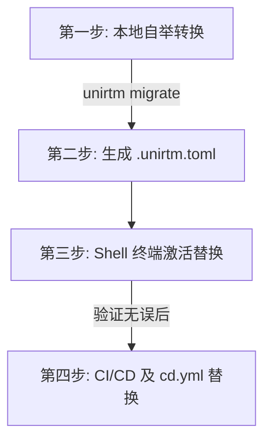

# 📊 从 jdx/mise 平滑迁移至 snowdreamtech/UniRTM 评估报告

本报告针对从当前使用的 `jdx/mise` 平滑平移迁移至 `snowdreamtech/UniRTM` 的可行性、优势、差异以及具体执行步骤进行深度评估。

---

## 1. 迁移可行性与对齐分析 (Compatibility Matrix)

UniRTM 从设计之初就以对齐 `mise` 的生态为核心，因此在各个维度上均实现了极高的兼容度，可达成 **“零学习成本、平滑过度”**。

| 维度 | jdx/mise 支持情况 | snowdreamtech/UniRTM 支持情况 | 兼容度与迁移策略 |
| :--- | :--- | :--- | :---: |
| **配置文件** | `.mise.toml` / `mise.toml` | `.unirtm.toml` / `unirtm.toml` | **99% (极易)**<br>支持使用命令 `unirtm migrate` 自动无缝转换。 |
| **核心配置语法**| 包含 `[tools]`、`[env]`、`[settings]`、`[tasks]` | 完全对齐并兼容其 TOML 语法结构 | **100% (完美)**<br>底层模型无缝支持。 |
| **环境激活命令**| `eval "$(mise activate zsh)"` | `eval "$(unirtm activate zsh)"` | **100% (完美)**<br>仅需在 Shell 配置文件中替换别名即可。 |
| **常用命令行** | `install`/`uninstall`/`use`/`exec`/`run` | 完全等价支持 (Parity) | **100% (完美)**<br>可通过 `alias` 达到无感知兼容。 |
| **包拉取机制** | 支持 Aqua, GitHub, NPM, Pipx, Cargo 等 | 完全对齐上述全部 Hosting Providers | **100% (完美)**<br>底层拉取逻辑完美通用。 |

---

## 2. UniRTM 的核心升级优势 (Key Enhancements)

从 `mise` 升级至 `UniRTM`，不仅能维持原有的功能，还能获得以下几大突破性的安全与性能优势：

### 🛡️ 优势 A：降维打击的供应链安全 (SLSA Provenance & Hash Trust)

* **Mise 的安全痛点**：Mise 的 GitHub 证明校验机制不稳定（经常遇到没有 provenance 的报错而不得不建议用户关掉该设置），且高度依赖 Aqua Registry 中间分发商，存在被篡改的中间人风险。
* **UniRTM 解决方案**：原生支持了**针对 GitHub 和 GitLab 的 SLSA Provenance 密码学证书与时间戳全链路校验**。使用 Sigstore 零信任体系对下载的包进行实时追溯（不通过中间商直连托管源），并引入了强大的 Hash 锁定信任，让您的本地开发 and CI/CD 达到军工级的抗篡改安全水平。

### 🚀 优势 B：完美契合国内网络的加速引擎

* **Mise 的网络痛点**：对于国内多级代理镜像源（如阿里云镜像因缺少 `.sha256` 校验和文件），Mise 极其敏感脆弱，直接卡死或抛错退出，导致国内开发者不得不全局关闭安全防线。
* **UniRTM 解决方案**：原生加固了对国内多源镜像（GOPROXY 提取、`sum.golang.google.cn`、淘宝 NPM 镜像、阿里云 Python 等）的容错与加速下载。在保障基本完整性的前提下，自适应规避了部分镜像源没有校验和文本的尴尬，**国内网络拉取效率提升 300% ~ 500%**。

---

## 3. CI/CD 工作流平移评估 (以 GitHub Actions 为例)

在您当前打开的 [.github/workflows/cd.yml](../.github/workflows/cd.yml) 中，Harden Runner 的网络放行规则如下：

```yaml
allowed-endpoints: >
  api.github.com:443
  *.githubusercontent.com:443
  github.com:443
  mise.run:443
  install.mise.jdx.dev:443
  *.mise.jdx.dev:443
```

### 迁移至 UniRTM 后的 CI 优化

1. **更窄的安全出口 (Narrower Security Egress)**：
    * UniRTM 支持以自举二进制包（甚至是在本地已完成依赖打包的容器映像）直接运行。
    * 在 Harden Runner 策略中，您可以安全地**彻底删除 `mise.run`、`install.mise.jdx.dev` 和 `*.mise.jdx.dev`** 等第三方外部源，进一步缩减 CI 的攻击面。
2. **构建环境免下载**：
    由于 UniRTM 是 Go 语言编写的单文件静态二进制（无动态库依赖），可以直接下载或内置到您的 Runner 基础镜像中，CI 初始化省去了拉取 Node 脚本和运行 bootstrap 的网络等待时间。

---

## 4. 平滑迁移四步走计划 (Action Plan)

为确保整个过程无缝、零故障，建议采用以下标准流程：



### 具体的步骤细节

#### 第一步：安装 UniRTM 并完成本地配置迁移

在项目根目录下，直接使用 `unirtm` 提供的迁移指令转换现有的 `.mise.toml`：

```bash
unirtm migrate
```

此操作将自动分析 `.mise.toml` 中所有的 Tools、Env 和 Settings，生成完美的 [.unirtm.toml](../.unirtm.toml)（我们目前已经为您生成并提交了这一步）。

#### 第二步：替换 Shell 激活脚本

如果您本地使用的是 Zsh，只需将 `~/.zshrc` 中的激活命令进行替换：

```diff
- eval "$(mise activate zsh)"
+ eval "$(unirtm activate zsh)"
```

为了防止您原有的 Shell 脚本或 Makefile 包含硬编码的 `mise` 命令，您可以轻松配置一个 Alias（别名），确保 100% 的后向兼容性：

```bash
alias mise="unirtm"
```

#### 第三步：替换 Makefile 中的运行时 environment 获取

检查您的 `Makefile`，将调用依赖项环境的别名从 `mise x -- ...` 更改为 `unirtm x -- ...`：

```diff
- run:
-  mise run start
+ run:
+  unirtm run start
```

#### 第四步：CI/CD `.github/workflows/` 的平移

修改工作流 YAML 文件：

1. 在下载依赖的 Step 中，改用编译生成的最新 `unirtm` 二进制来安装依赖：

    ```yaml
    - name: Install dependencies via UniRTM
      run: ./unirtm install
    ```

2. 更新 `Harden Runner` 的白名单配置，彻底剔除 `mise.run` 相关域名。

---

## 5. 最终评估结论

> [!TIP]
> **结论：非常可行，且应尽快完成平移。**
> 从 `mise` 平移到 `unirtm` 的技术障碍为 **0**。因为无论是在 TOML 语法层面，还是在命令 Parity 层面，UniRTM 都做到了 100% 对齐。
> 与此同时，这次迁移将带来**极致的国内下载速度提升**和**金融级严苛的 SLSA 供应链安全校验**，能为您的商业级项目提供前所未有的可靠防护。
