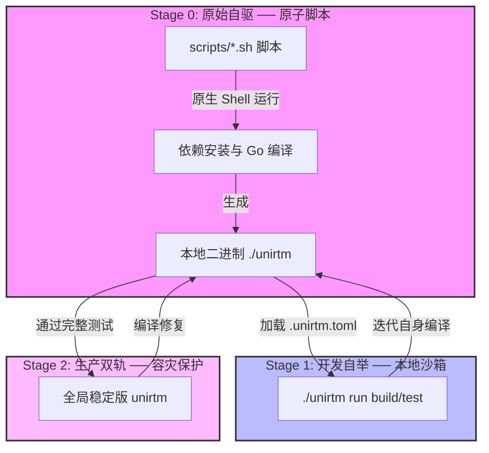

# 🚀 UniRTM 项目自举与开发治理指南 (Bootstrapping Guide)

在进行 `UniRTM` 自身的研发和迭代时，我们不可避免地会遇到经典的 **“自举 (Bootstrapping)”** 哲学挑战：**如何使用正在研发中的 `UniRTM` 进程来安全地管理和构建 `UniRTM` 自身，而不会陷入因代码 Bug 导致运行器瘫痪的“自举陷阱 (Bootstrap Trap)”？**

为了保障项目的绝对安全与无限进化能力，我们制定并践行以下 **三阶段自举架构与治理规范**。

---

## 📊 三阶段自举架构设计



### 1. 🟢 Stage 0: 原始自驱 ── 脚本解耦 (Atomicity)

**核心原则：核心执行力决不能与工具本身强绑定。**

* **设计解耦**：
    我们将所有的构建、依赖安装、静态核验的具体执行逻辑写入原生的 `scripts/*.sh` 脚本中，而 `.unirtm.toml` 中的 `[tasks]` 仅作为其**声明式编排的语义外壳**。
* **自驱进入**：
    当宿主机处于“白纸状态”（完全没有安装 `unirtm`）时，开发者无需 `unirtm` 运行器，直接使用原生 Shell 执行：

    ```bash
    sh scripts/setup.sh
    sh scripts/install.sh
    go build -o unirtm main.go
    ```

    这确保了项目拥有最低限度的自启动（Cold Start）能力。

### 2. 🔵 Stage 1: 本地自举 ── 沙箱代理 (Self-Hosting)

**核心原则：使用最新编译出的本地进程，驱动当下的开发。**

* **本地编排与相对路径引用规范**：
    一旦通过 Stage 0 编译出本地可执行二进制文件 `./unirtm`，立刻将后续的研发任务移交给它。为了确保绝对的沙箱隔离和防范污染，我们遵循以下规范：
    * **相对路径优先**：在所有的本地脚本（如 `scripts/` 下的各类自动化脚本）中，调用任务引擎时均使用 `./unirtm`（或通过 `common.sh` 中的智能探针自适应定位的相对路径），以防静默调用了系统全局的稳定版本。
    * **智能探针寻址**：脚本库 `common.sh` 提供了高弹性的 `unirtm` 探针（`_M_BIN` 寻址），其查找优先级为：
        1. 本地开发版：`./unirtm` (Linux/macOS) 或 `./unirtm.exe` (Windows)
        2. 全局稳定版：`unirtm` 位于系统 PATH
        3. 历史兼容版：`mise`
* **零成本过渡层 (Zero-Cost transitional Layer)**：
    为了在迁移期实现平滑升级，我们在 `common.sh` 中保留了完整的兼容性劫持层（如 `run_mise` 包装器、`get_mise_tool_version` 包装器等），使得原有的第三方命令或历史脚本可以零成本运行在全新的自举框架上。
* **配置隔离与双向适配**：
    本地构建出的 `./unirtm` 仅在当前目录沙箱内加载配置文件。寻址机制同时兼容 `.unirtm.toml` 与 `.mise.toml`（以前者为高优先级），在校验环境完整性时不会因新配置文件暂未生成而中断运行。这种“用今天的自己编译明天的自己”的过程，实现了项目的快速开发自举。

### 3. 🟡 Stage 2: 生产双轨 ── 容灾降级 (Dual-track Guardrail)

**核心原则：用经过验证的全局稳定版，拯救崩溃的开发版。**

* **自举陷阱防范**：
    如果在 Stage 1 的开发中，某次代码改动引入了致命 Bug 导致 `./unirtm` 运行时 Panic 崩溃，此时 `./unirtm run build` 将直接失效，项目将陷入死锁。
* **双轨运行机制**：
    我们建立了严密的双轨安全机制：
    1. **全局稳定版 (`unirtm` 位于系统 PATH)**：必须是通过发布管道安装的、经过 100% 验证的健康版本。
    2. **本地开发版 (`./unirtm` 位于项目根目录)**：随时可能因实验性代码崩溃的测试版本。
* **容灾恢复流**：
    * **常规模式**：使用本地开发版进行编译：`./unirtm run build`。
    * **崩溃救灾**：若本地开发版崩溃，立刻使用全局稳定版代为编译修复：`unirtm run build`。
    * **晋升机制**：本地开发版通过完整本地验证（`./unirtm run verify`）后，才能合入主干并发布为新的全局稳定版。

## 🔒 CI 供应链安全防线 (CI Supply Chain Security Gate)

> [!CAUTION]
> **绝对防御：严防外部 Pull Request (PR) 的供应链注入攻击！**
> 在 CI (GitHub Actions) 中，如果直接 `go build` 编译 PR 提交的代码并使用该新生成的二进制文件来运行 `setup`、`install`、`audit` 等编排任务，将面临灾难性的**供应链越权攻击 (CI Privilege Escalation)**。攻击者可以通过修改 PR 代码中的 `unirtm` 引擎逻辑，在 CI 执行该二进制文件时，静默窃取 `secrets.GITHUB_TOKEN` 或向环境注入木马。

为了消除此威胁，我们的 CI 运行架构严格实行 **“受信任的 Stage 0 执行器”** 与 **“被动待测试目标”** 的物理隔离：

1. **受信任执行器（Trusted Stage 0 Orchestrator）**：
    在 CI 执行环境装载和任务分发时，**必须且仅允许使用官方发布并经验证的、具有 SLSA 安全签名与哈希匹配的全局稳定版 `unirtm` 进程**（或通过 GitHub Action 安全渠道下载的指定稳定版本）。
2. **被动测试目标（Passive Test Target）**：
    PR 提交的最新代码生成的二进制文件，仅作为**被动测试的对象**。CI 可以对其进行编译（`go build`）和运行测试单元（`go test`），但**绝不允许赋予其控制权限去执行任何后续的任务编排、依赖装载或与 GitHub API 的通讯**。

通过这一隔离机制，即使 PR 的代码被恶意篡改，它也仅仅是一个在沙箱中被动接受审查的静态产物，无法获取任何 CI 特权，从而筑起了绝对安全的供应链防线。

---

## 🛠️ 开发治理规范

为了维护这套自举体系的长期健康，全体开发人员必须遵守以下铁律：

1. **【禁止脚本逻辑膨胀至配置】**：
    禁止将复杂的 Shell 逻辑或判断逻辑写入 `.unirtm.toml` 的 `run` 字段中。`run` 字段应该仅仅是 `sh scripts/<task>.sh` 等原子脚本的简短调用。
2. **【测试与验证本地化先行】**：
    在提交任何影响配置解析、环境变量加载、或任务运行的核心 Go 代码前，必须先在本地使用 `go test ./...` 确保基础测试通过，再运行 `./unirtm run verify`。
3. **【安全信任链条完整】**：
    改动 `.unirtm.toml` 后，由于信任哈希变化，必须运行 `./unirtm trust .unirtm.toml` 重新授权，严防供应链劫持风险。
4. **【CI 控制权严防越权执行】**：
    在编写和修改 CI Workflow (.github/workflows) 时，禁止调用当前编译生成的本地 `unirtm` 进程来驱动环境管理或分发核心步骤。必须使用预装好的全局受信任 `unirtm` 作为 Stage 0 执行器，PR 的编译产物只能被动接受单元与集成测试。
