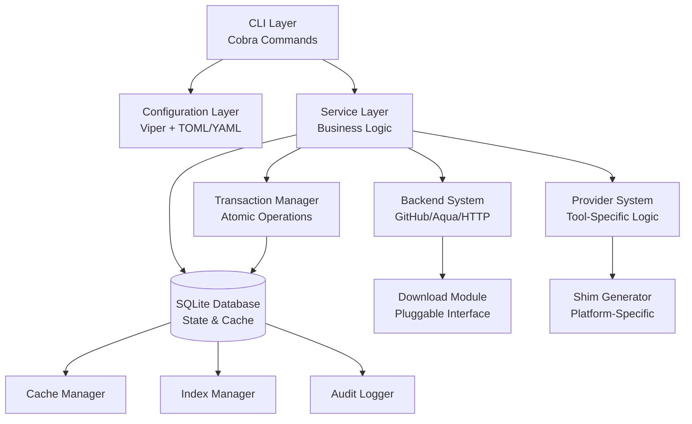
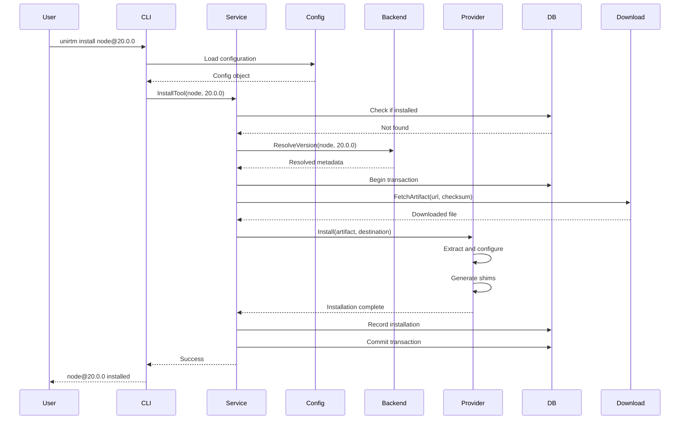

# UniRTM Design Document

## Overview

UniRTM (Universal Runtime Manager) is a high-performance development environment management tool written in Go, designed as a reimplementation of mise with improved performance, maintainability, and explicit operational semantics. The system manages multiple development tool versions through a layered architecture consisting of configuration management, SQLite-based state persistence, pluggable backend systems, and provider-specific installation logic.

### Design Goals

1. **Performance**: Fast tool resolution, installation, and activation through aggressive caching and concurrent operations
2. **Explicitness**: No implicit fallbacks or silent defaults — all operations require explicit user intent
3. **Auditability**: Comprehensive logging and audit trails for all system operations
4. **Atomicity**: All operations are atomic with transaction support and automatic rollback on failure
5. **Extensibility**: Pluggable architecture for backends, providers, and download implementations
6. **Cross-Platform**: Full support for Linux, macOS, and Windows with platform-specific optimizations

### Key Architectural Principles

- **Layered Architecture**: Clear separation between configuration, business logic, data access, and infrastructure
- **Dependency Inversion**: Core business logic depends on abstractions, not concrete implementations
- **Single Responsibility**: Each component has one well-defined purpose
- **Fail Fast**: Validate inputs and preconditions early, return clear errors immediately
- **Explicit Over Implicit**: Require explicit version specifications, no silent version resolution

## Architecture

### High-Level Architecture



### Layer Responsibilities

#### 1. CLI Layer (`cmd/`)

- Command-line interface using Cobra framework
- Argument parsing and validation
- User interaction and progress reporting
- Delegates to service layer for business logic

#### 2. Configuration Layer (`internal/config/`)

- TOML/YAML parsing using Viper
- Hierarchical configuration loading (system → global → project → local)
- Environment-specific overrides
- Configuration validation and schema enforcement

#### 3. Service Layer (`internal/service/`)

- Core business logic
- Orchestrates operations across backends, providers, and database
- Implements atomic operations with transaction support
- Error handling and recovery logic

#### 4. Backend System (`internal/backend/`)

- Pluggable backend implementations (GitHub, Aqua, HTTP)
- Version listing and resolution
- Artifact download coordination
- Backend registry and discovery

#### 5. Provider System (`internal/provider/`)

- Tool-specific installation logic
- Post-installation hooks
- Shim generation
- Version detection from existing installations

#### 6. Data Layer (`internal/repository/`)

- SQLite database access
- Cache management
- Index management
- Audit log persistence

#### 7. Infrastructure Layer (`internal/pkg/`)

- Download implementations
- File system operations
- Platform-specific utilities
- Logging (zerolog)

### Data Flow



## Components and Interfaces

### Configuration System

#### ConfigManager Interface

```go
type ConfigManager interface {
    // Load loads configuration from the specified path
    Load(ctx context.Context, path string) (*Config, error)

    // LoadHierarchy loads configuration from all hierarchy levels
    LoadHierarchy(ctx context.Context) (*Config, error)

    // Validate validates the configuration
    Validate(ctx context.Context, config *Config) error

    // Merge merges multiple configurations with precedence rules
    Merge(configs ...*Config) (*Config, error)
}
```

#### Config Structure

```go
type Config struct {
    // Tools maps tool names to version specifications
    Tools map[string]ToolConfig `toml:"tools" yaml:"tools"`

    // Env contains environment variable definitions
    Env map[string]string `toml:"env" yaml:"env"`

    // Settings contains global settings
    Settings Settings `toml:"settings" yaml:"settings"`

    // Tasks contains task definitions
    Tasks map[string]Task `toml:"tasks" yaml:"tasks"`
}

type ToolConfig struct {
    // Version is the version specification (exact, range, or alias)
    Version string `toml:"version" yaml:"version"`

    // Backend specifies the backend to use (optional)
    Backend string `toml:"backend,omitempty" yaml:"backend,omitempty"`

    // Provider specifies the provider to use (optional)
    Provider string `toml:"provider,omitempty" yaml:"provider,omitempty"`
}

type Settings struct {
    // CacheDir is the directory for cached downloads
    CacheDir string `toml:"cache_dir" yaml:"cache_dir"`

    // DataDir is the directory for SQLite database and state
    DataDir string `toml:"data_dir" yaml:"data_dir"`

    // CacheTTL is the default cache TTL in seconds
    CacheTTL int `toml:"cache_ttl" yaml:"cache_ttl"`

    // Concurrency is the maximum number of concurrent operations
    Concurrency int `toml:"concurrency" yaml:"concurrency"`
}
```

### Backend System

#### Backend Interface

```go
type Backend interface {
    // Name returns the backend name
    Name() string

    // ListVersions lists all available versions for a tool
    ListVersions(ctx context.Context, tool string) ([]string, error)

    // GetLatestVersion returns the latest version for a tool
    GetLatestVersion(ctx context.Context, tool string) (string, error)

    // ResolveVersion resolves a version specification to a concrete version
    ResolveVersion(ctx context.Context, tool string, spec string) (string, error)

    // GetArtifactURL returns the download URL for a specific version
    GetArtifactURL(ctx context.Context, tool string, version string, platform Platform) (string, error)

    // GetChecksum returns the expected checksum for an artifact
    GetChecksum(ctx context.Context, tool string, version string, platform Platform) (string, error)

    // VerifyInstallation verifies that a tool is correctly installed
    VerifyInstallation(ctx context.Context, tool string, version string, installPath string) error
}

type Platform struct {
    OS   string // linux, darwin, windows
    Arch string // amd64, arm64, 386
}
```

#### Backend Implementations

1. **GitHubBackend**: Fetches releases from GitHub Releases API
2. **AquaBackend**: Integrates with Aqua registry for tool metadata
3. **HTTPBackend**: Direct HTTP downloads from arbitrary URLs

### Provider System

#### Provider Interface

```go
type Provider interface {
    // Name returns the provider name
    Name() string

    // Detect detects the version of an existing installation
    DetectVersion(ctx context.Context, installPath string) (string, error)

    // Install installs a tool from an artifact
    Install(ctx context.Context, artifact string, destination string) error

    // PostInstall runs post-installation hooks
    PostInstall(ctx context.Context, tool string, version string, installPath string) error

    // GenerateShims generates shim scripts for the tool
    GenerateShims(ctx context.Context, tool string, version string, installPath string, shimDir string) error

    // Uninstall removes a tool installation
    Uninstall(ctx context.Context, tool string, version string, installPath string) error
}
```

#### Provider Implementations

1. **GenericProvider**: Default provider for tools without special requirements
2. **NodeProvider**: Node.js-specific installation and shim generation
3. **PythonProvider**: Python-specific installation with virtual environment support
4. **GoProvider**: Go-specific installation with GOPATH management

### Download System

#### Downloader Interface

```go
type Downloader interface {
    // Download downloads a file from a URL to a destination
    Download(ctx context.Context, url string, destination string, opts DownloadOptions) error

    // VerifyChecksum verifies the checksum of a downloaded file
    VerifyChecksum(ctx context.Context, file string, expectedChecksum string) error
}

type DownloadOptions struct {
    // Checksum is the expected SHA-256 checksum
    Checksum string

    // MaxRetries is the maximum number of retry attempts
    MaxRetries int

    // Timeout is the total operation timeout
    Timeout time.Duration

    // ProgressCallback is called with download progress
    ProgressCallback func(bytesDownloaded, totalBytes int64)
}
```

#### HTTPDownloader Implementation

- Retry logic with exponential backoff (1s → 2s → 4s → 8s → 16s)
- Connection timeout: 10 seconds
- Read timeout: 60 seconds
- Proxy support via HTTP_PROXY/HTTPS_PROXY environment variables
- Automatic checksum verification after download

### Database System

#### Repository Interfaces

```go
type InstallationRepository interface {
    // Create records a new installation
    Create(ctx context.Context, installation *Installation) error

    // FindByToolAndVersion finds an installation by tool and version
    FindByToolAndVersion(ctx context.Context, tool string, version string) (*Installation, error)

    // List lists all installations
    List(ctx context.Context) ([]*Installation, error)

    // Delete removes an installation record
    Delete(ctx context.Context, tool string, version string) error
}

type CacheRepository interface {
    // Set stores a cache entry
    Set(ctx context.Context, key string, value []byte, ttl time.Duration) error

    // Get retrieves a cache entry
    Get(ctx context.Context, key string) ([]byte, error)

    // Delete removes a cache entry
    Delete(ctx context.Context, key string) error

    // Purge removes all expired cache entries
    Purge(ctx context.Context) error
}

type AuditRepository interface {
    // Log records an audit log entry
    Log(ctx context.Context, entry *AuditEntry) error

    // Query queries audit logs with filters
    Query(ctx context.Context, filter AuditFilter) ([]*AuditEntry, error)
}
```

### Transaction Manager

```go
type TransactionManager interface {
    // Begin starts a new transaction
    Begin(ctx context.Context) (Transaction, error)
}

type Transaction interface {
    // Commit commits the transaction
    Commit() error

    // Rollback rolls back the transaction
    Rollback() error

    // InstallationRepo returns the installation repository for this transaction
    InstallationRepo() InstallationRepository

    // CacheRepo returns the cache repository for this transaction
    CacheRepo() CacheRepository

    // AuditRepo returns the audit repository for this transaction
    AuditRepo() AuditRepository
}
```

## Data Models

### Core Domain Models

```go
// Installation represents an installed tool
type Installation struct {
    ID          int64     `db:"id"`
    Tool        string    `db:"tool"`
    Version     string    `db:"version"`
    Backend     string    `db:"backend"`
    Provider    string    `db:"provider"`
    InstallPath string    `db:"install_path"`
    Checksum    string    `db:"checksum"`
    InstalledAt time.Time `db:"installed_at"`
    Metadata    string    `db:"metadata"` // JSON-encoded metadata
}

// CacheEntry represents a cached item
type CacheEntry struct {
    Key       string    `db:"key"`
    Value     []byte    `db:"value"`
    ExpiresAt time.Time `db:"expires_at"`
    CreatedAt time.Time `db:"created_at"`
}

// AuditEntry represents an audit log entry
type AuditEntry struct {
    ID        int64     `db:"id"`
    Timestamp time.Time `db:"timestamp"`
    Operation string    `db:"operation"` // install, uninstall, activate, etc.
    Tool      string    `db:"tool"`
    Version   string    `db:"version"`
    Status    string    `db:"status"` // success, failure
    Error     string    `db:"error"`
    Duration  int64     `db:"duration_ms"`
    Metadata  string    `db:"metadata"` // JSON-encoded metadata
}

// IndexEntry represents a tool in the index
type IndexEntry struct {
    Tool        string    `db:"tool"`
    Description string    `db:"description"`
    Homepage    string    `db:"homepage"`
    License     string    `db:"license"`
    Backend     string    `db:"backend"`
    UpdatedAt   time.Time `db:"updated_at"`
    Metadata    string    `db:"metadata"` // JSON-encoded metadata
}
```

### Database Schema

```sql
-- installations table
CREATE TABLE installations (
    id INTEGER PRIMARY KEY AUTOINCREMENT,
    tool TEXT NOT NULL,
    version TEXT NOT NULL,
    backend TEXT NOT NULL,
    provider TEXT NOT NULL,
    install_path TEXT NOT NULL,
    checksum TEXT NOT NULL,
    installed_at TIMESTAMP NOT NULL DEFAULT CURRENT_TIMESTAMP,
    metadata TEXT,
    UNIQUE(tool, version)
);

CREATE INDEX idx_installations_tool ON installations(tool);
CREATE INDEX idx_installations_installed_at ON installations(installed_at);

-- cache table
CREATE TABLE cache (
    key TEXT PRIMARY KEY,
    value BLOB NOT NULL,
    expires_at TIMESTAMP NOT NULL,
    created_at TIMESTAMP NOT NULL DEFAULT CURRENT_TIMESTAMP
);

CREATE INDEX idx_cache_expires_at ON cache(expires_at);

-- audit_log table
CREATE TABLE audit_log (
    id INTEGER PRIMARY KEY AUTOINCREMENT,
    timestamp TIMESTAMP NOT NULL DEFAULT CURRENT_TIMESTAMP,
    operation TEXT NOT NULL,
    tool TEXT,
    version TEXT,
    status TEXT NOT NULL,
    error TEXT,
    duration_ms INTEGER,
    metadata TEXT
);

CREATE INDEX idx_audit_log_timestamp ON audit_log(timestamp);
CREATE INDEX idx_audit_log_operation ON audit_log(operation);
CREATE INDEX idx_audit_log_tool ON audit_log(tool);

-- index table
CREATE TABLE tool_index (
    tool TEXT PRIMARY KEY,
    description TEXT,
    homepage TEXT,
    license TEXT,
    backend TEXT NOT NULL,
    updated_at TIMESTAMP NOT NULL DEFAULT CURRENT_TIMESTAMP,
    metadata TEXT
);

CREATE INDEX idx_tool_index_backend ON tool_index(backend);
CREATE INDEX idx_tool_index_updated_at ON tool_index(updated_at);
```

## Error Handling

### Error Classification

UniRTM classifies errors into three categories:

1. **User Errors**: Invalid input, configuration errors, version not found
   - Return descriptive error messages
   - Suggest corrective actions
   - Exit with code 1

2. **System Errors**: Disk full, permission denied, database corruption
   - Log full error context
   - Return generic user-safe message
   - Exit with code 2

3. **External Errors**: Network failures, backend API errors, download failures
   - Implement retry logic
   - Log failure details
   - Return wrapped error with context
   - Exit with code 3

### Error Types

```go
// ErrNotFound indicates a resource was not found
var ErrNotFound = errors.New("not found")

// ErrAlreadyExists indicates a resource already exists
var ErrAlreadyExists = errors.New("already exists")

// ErrInvalidConfig indicates invalid configuration
var ErrInvalidConfig = errors.New("invalid configuration")

// ErrNetworkFailure indicates a network operation failed
var ErrNetworkFailure = errors.New("network failure")

// ErrChecksumMismatch indicates checksum verification failed
var ErrChecksumMismatch = errors.New("checksum mismatch")

// ErrTransactionFailed indicates a transaction failed
var ErrTransactionFailed = errors.New("transaction failed")
```

### Error Wrapping

All errors are wrapped with context using `fmt.Errorf` with `%w`:

```go
user, err := repo.FindByID(ctx, id)
if err != nil {
    return nil, fmt.Errorf("find user %d: %w", id, err)
}
```

### Recovery Mechanism

When an atomic operation fails:

1. Transaction is automatically rolled back
2. Partial files are cleaned up
3. Database state is restored
4. Error is logged to audit log
5. User receives clear error message with recovery suggestions

On next startup, the system:

1. Scans for incomplete operations
2. Offers to retry or rollback
3. Cleans up orphaned files
4. Repairs database inconsistencies

## Testing Strategy

### Unit Testing

- Test coverage target: ≥ 80% for all packages
- Use table-driven tests with `t.Run()` for comprehensive input coverage
- Use testify for assertions: `require.NoError(t, err)`, `assert.Equal(t, expected, actual)`
- Mock external dependencies using interfaces
- Test error paths explicitly

### Integration Testing

- Use Testcontainers for SQLite database tests
- Test full workflows: install → activate → use → uninstall
- Test configuration loading from real TOML/YAML files
- Test backend integrations with mock HTTP servers
- Test concurrent operations with race detector (`go test -race`)

### End-to-End Testing

- Test complete user workflows via CLI
- Test cross-platform compatibility (Linux, macOS, Windows)
- Test migration from mise configurations
- Test recovery from failures
- Test performance under load

### Performance Testing

- Benchmark critical paths: version resolution, installation, activation
- Profile memory usage and allocations
- Test concurrent installation performance
- Measure cache hit rates
- Test database query performance

### Test Organization

```
tests/
├── unit/                    # Unit tests
│   ├── config/
│   ├── backend/
│   ├── provider/
│   └── repository/
├── integration/             # Integration tests
│   ├── database/
│   ├── backend/
│   └── workflow/
└── e2e/                     # End-to-end tests
    ├── install_test.go
    ├── activate_test.go
    └── migration_test.go
```

## Security Considerations

### Checksum Verification

- All downloaded artifacts MUST be verified with SHA-256 checksums
- Checksums are fetched from trusted sources (GitHub releases, Aqua registry)
- Failed checksum verification prevents installation and triggers cleanup

### Signature Verification

- Support GPG signature verification for tools that provide signatures
- Warn users when installing tools without signature verification
- Store verification results in audit log

### Secure Downloads

- Use HTTPS for all downloads
- Support custom CA certificates via environment variables
- Validate TLS certificates (no insecure skip verify)
- Support proxy configuration via HTTP_PROXY/HTTPS_PROXY

### Privilege Management

- Never require root/administrator privileges for normal operations
- Install tools in user-writable directories
- Use least privilege for file operations
- Validate file permissions before execution

### Audit Trail

- Log all installations, activations, and configuration changes
- Record checksums and verification results
- Store full error context for failed operations
- Support audit log export for compliance

## Performance Optimizations

### Caching Strategy

1. **Metadata Cache**: Cache GitHub release metadata, version lists (TTL: 24 hours)
2. **Artifact Cache**: Cache downloaded tarballs indefinitely (verified by checksum)
3. **Resolution Cache**: Cache version resolution results (TTL: 1 hour)
4. **Index Cache**: Cache tool index (TTL: 7 days)

### Concurrent Operations

- Install multiple tools in parallel (default: CPU count)
- Use errgroup for coordinated concurrent operations
- Serialize database writes using transactions
- Use connection pooling for database access

### Database Optimizations

- Use prepared statements for repeated queries
- Create indexes on frequently queried columns
- Use WAL mode for better concurrent read performance
- Implement connection pooling with configurable limits

### Download Optimizations

- Resume interrupted downloads using HTTP Range requests
- Use connection pooling for HTTP clients
- Implement parallel chunk downloads for large files
- Compress cache entries to save disk space

## Migration from Mise

### Configuration Migration

The migration tool converts mise configurations to UniRTM format:

1. Parse `.mise.toml` and `.tool-versions` files
2. Convert tool version specifications
3. Map mise backends to UniRTM backends
4. Preserve environment variables and settings
5. Generate UniRTM configuration files

### Installation Migration

1. Detect existing mise installations
2. Offer to import tool installations
3. Verify checksums of existing installations
4. Record installations in UniRTM database
5. Generate shims for imported tools

### Migration Report

Generate a detailed report showing:

- Converted configuration files
- Imported tool installations
- Unsupported features and suggested alternatives
- Manual migration steps required

## Deployment and Operations

### Installation

```bash
# Download and install UniRTM
curl -fsSL https://unirtm.sh | sh

# Or using Go
go install github.com/snowdreamtech/unirtm@latest
```

### Configuration

System-wide configuration: `/etc/unirtm/config.toml`
User configuration: `~/.config/unirtm/config.toml`
Project configuration: `.unirtm.toml` or `unirtm.toml`

### Monitoring

- Expose metrics endpoint for Prometheus
- Track operation durations, cache hit rates, error rates
- Monitor database size and query performance
- Alert on repeated failures or performance degradation

### Logging

- Use zerolog for structured JSON logging
- Log levels: Trace, Debug, Info, Warn, Error, Fatal
- Rotating log files: `unirtm.log` (operations), `error.log` (errors)
- Include request IDs for distributed tracing

### Health Checks

The `doctor` command performs comprehensive health checks:

- Database accessibility and integrity
- Cache directory writability
- Installed tools verification
- Shim script validation
- Network connectivity to backends
- Configuration file validation

## Future Enhancements

### Phase 2 Features

1. **Plugin System**: Support for third-party backends and providers
2. **Remote State**: Share tool configurations across teams
3. **Dependency Graphs**: Visualize tool dependencies
4. **Auto-Update**: Automatic tool updates based on policies
5. **Shell Integration**: Deep integration with bash, zsh, fish, PowerShell

### Phase 3 Features

1. **Container Support**: Manage containerized tool versions
2. **Cloud Backends**: Support for S3, GCS, Azure Blob storage
3. **Team Collaboration**: Shared tool registries and configurations
4. **Policy Enforcement**: Enforce tool version policies across teams
5. **Advanced Caching**: Distributed cache with Redis/Memcached

## Appendix

### Reference Implementations

- **mise**: <https://github.com/jdx/mise> - Reference architecture and concepts
- **Standard Go Layout**: <https://github.com/golang-standards/project-layout> - Reference Go code style

### Technology Stack

- **Language**: Go 1.21+
- **CLI Framework**: Cobra
- **Configuration**: Viper (TOML/YAML)
- **Database**: SQLite with mattn/go-sqlite3
- **Logging**: zerolog
- **Testing**: testify, Testcontainers
- **HTTP Client**: Go standard library with retry logic

### Glossary

See README.md for complete glossary of terms.

## Correctness Properties

*A property is a characteristic or behavior that should hold true across all valid executions of a system—essentially, a formal statement about what the system should do. Properties serve as the bridge between human-readable specifications and machine-verifiable correctness guarantees.*

### Property Reflection

After analyzing all acceptance criteria, the following properties have been identified and consolidated to eliminate redundancy:

**Consolidated Properties:**

- Properties 1.1 and 1.2 (TOML/YAML parsing) are combined with 26.1, 26.2, 26.7, 26.8 into comprehensive round-trip properties
- Properties 2.2, 2.3, 2.4, 2.5 (database storage) are combined into a single data persistence round-trip property
- Properties 26.4 and 26.5 (pretty printing) are subsumed by the round-trip properties 26.7 and 26.8
- Properties 27.1, 27.5, 27.6 (version parsing/formatting) are combined into a single round-trip property

### Property 1: Configuration Round-Trip (TOML)

*For any* valid Configuration object, serializing to TOML, parsing back, and serializing again SHALL produce an equivalent Configuration object and identical TOML output.

**Validates: Requirements 1.1, 26.1, 26.4, 26.7**

**Test Strategy**: Generate random Configuration objects with various tool definitions, environment variables, and settings. Serialize to TOML using Viper, parse back into a Configuration object, verify structural equivalence using deep equality, then serialize again and verify the TOML output is identical.

### Property 2: Configuration Round-Trip (YAML)

*For any* valid Configuration object, serializing to YAML, parsing back, and serializing again SHALL produce an equivalent Configuration object and identical YAML output.

**Validates: Requirements 1.2, 26.2, 26.5, 26.8**

**Test Strategy**: Generate random Configuration objects with various tool definitions, environment variables, and settings. Serialize to YAML using Viper, parse back into a Configuration object, verify structural equivalence using deep equality, then serialize again and verify the YAML output is identical.

### Property 3: Configuration Validation Completeness

*For any* Configuration object with missing required fields, the Configuration_Validator SHALL reject it and return an error identifying all missing fields.

**Validates: Requirements 1.3**

**Test Strategy**: Generate Configuration objects with various combinations of missing required fields (tools, settings, etc.). Verify that validation fails and the error message identifies all missing fields, not just the first one.

### Property 4: Invalid Syntax Error Reporting

*For any* syntactically invalid TOML or YAML configuration file, the Config_Parser SHALL return an error with line number, column number, and a descriptive message.

**Validates: Requirements 1.4, 26.3**

**Test Strategy**: Generate invalid TOML/YAML files with various syntax errors (missing quotes, invalid indentation, unclosed brackets, etc.). Verify that parsing fails and the error includes line number, column number, and describes the syntax issue.

### Property 5: Configuration Merge Precedence

*For any* set of Configuration objects at different hierarchy levels (system, global, project, local), merging them SHALL apply the most specific configuration, with local overriding project overriding global overriding system.

**Validates: Requirements 1.5, 1.6**

**Test Strategy**: Generate Configuration objects at multiple hierarchy levels with overlapping tool definitions. Merge them and verify that values from more specific levels override values from less specific levels. Test with various combinations of defined and undefined values at each level.

### Property 6: Environment-Specific Configuration Selection

*For any* Configuration with environment-specific overrides, selecting a specific environment SHALL apply only the overrides for that environment while preserving base configuration values.

**Validates: Requirements 1.7**

**Test Strategy**: Generate Configuration objects with base values and environment-specific overrides for multiple environments (development, staging, production). Select each environment and verify that only the correct overrides are applied while base values remain unchanged.

### Property 7: Configuration Loading Idempotence

*For any* valid configuration file, loading it multiple times SHALL produce identical Configuration objects.

**Validates: Requirements 1.8**

**Test Strategy**: Generate random configuration files (TOML and YAML). Load each file multiple times and verify that all resulting Configuration objects are deeply equal. Test with various file sizes and complexity levels.

### Property 8: Database Persistence Round-Trip

*For any* valid data object (Installation, CacheEntry, AuditEntry, IndexEntry), storing it in the database and retrieving it SHALL produce an equivalent object.

**Validates: Requirements 2.2, 2.3, 2.4, 2.5**

**Test Strategy**: Generate random instances of each data model type with various field values. Store each instance in the database, retrieve it by its primary key, and verify deep equality. Test with edge cases like empty strings, null values, and maximum field lengths.

### Property 9: Concurrent Database Reads

*For any* set of concurrent read operations on the database, all reads SHALL complete successfully without conflicts or data corruption.

**Validates: Requirements 2.7**

**Test Strategy**: Generate random read queries (installations, cache entries, audit logs). Execute them concurrently from multiple goroutines using errgroup. Verify all reads complete successfully and return consistent data. Use the race detector to catch data races.

### Property 10: Transaction Atomicity

*For any* database transaction that fails, all changes within that transaction SHALL be rolled back, leaving the database in its pre-transaction state.

**Validates: Requirements 2.8, 2.9**

**Test Strategy**: Generate random sequences of database operations (inserts, updates, deletes). Execute them within a transaction, inject a failure at a random point, and verify that the database state is unchanged from before the transaction began. Test with various failure points and operation types.

### Property 11: Installation Atomicity

*For any* tool installation that fails at any stage (download, verify, extract, activate), all partial artifacts SHALL be removed and the database SHALL contain no record of the installation.

**Validates: Requirements 3.1, 3.4**

**Test Strategy**: Generate random tool installation scenarios. Inject failures at various stages (download failure, checksum mismatch, extraction error, activation failure). Verify that all partial files are cleaned up, no database records exist, and the system state is unchanged.

### Property 12: Configuration Update Atomicity

*For any* configuration update operation that fails, the configuration SHALL remain in its pre-update state with no partial changes applied.

**Validates: Requirements 3.2**

**Test Strategy**: Generate random configuration update operations. Inject failures during the update process (file write error, validation failure, permission denied). Verify that the configuration file remains unchanged and no partial updates are visible.

### Property 13: Download Retry Behavior

*For any* download operation that encounters transient failures, the HTTP_Downloader SHALL retry up to 5 times with exponential backoff (1s, 2s, 4s, 8s, 16s) before failing.

**Validates: Requirements 4.3**

**Test Strategy**: Generate random download scenarios with transient failures (connection reset, timeout, 503 errors). Mock the HTTP client to fail a specific number of times, then succeed. Verify retry attempts match the expected count and timing follows exponential backoff. Verify final failure after 5 attempts.

### Property 14: Checksum Verification

*For any* downloaded artifact, if the computed SHA-256 checksum does not match the expected checksum, the download SHALL fail and the artifact SHALL be deleted.

**Validates: Requirements 4.6**

**Test Strategy**: Generate random file contents and checksums. Download files with intentionally mismatched checksums. Verify that verification fails, the file is deleted, and an appropriate error is returned. Test with various file sizes and checksum formats.

### Property 15: Download Error Reporting

*For any* download operation that fails after maximum retries, the error message SHALL include the URL, the number of attempts, and the specific failure reason from the last attempt.

**Validates: Requirements 4.7**

**Test Strategy**: Generate various download failure scenarios (network errors, HTTP errors, timeout errors). Verify that the returned error message contains the URL, attempt count, and the specific error from the final attempt. Test with different error types.

### Property 16: Backend Version Listing

*For any* backend and tool combination, querying for available versions SHALL return a list of version strings that can be resolved to concrete versions.

**Validates: Requirements 5.5**

**Test Strategy**: Generate mock backend responses with various version lists (semver, date-based, pre-release tags). Query for versions and verify the returned list matches the expected format. Test with empty lists, single versions, and large version lists.

### Property 17: Backend Error Structure

*For any* backend operation that fails, the returned error SHALL include the operation type, tool name, backend name, and the underlying failure reason.

**Validates: Requirements 5.8**

**Test Strategy**: Generate various backend failure scenarios (API errors, network failures, invalid responses). Verify that each error contains all required context fields. Test error unwrapping with errors.Is() and errors.As().

### Property 18: Shim Generation Completeness

*For any* tool installation, the Provider SHALL generate shim scripts for all executables provided by the tool, and each shim SHALL be executable and delegate to the correct tool version.

**Validates: Requirements 6.4**

**Test Strategy**: Generate random tool installations with various numbers of executables. Verify that shims are created for each executable, have correct permissions (executable), and contain the correct delegation logic. Test on multiple platforms (Linux, macOS, Windows).

### Property 19: Version Detection Accuracy

*For any* existing tool installation, the Provider SHALL detect the installed version and return a version string that matches the version recorded in the database.

**Validates: Requirements 6.7**

**Test Strategy**: Generate random tool installations with various version formats. Install tools and record versions in the database. Use the Provider to detect versions and verify they match the database records. Test with various version formats (semver, date-based, custom).

### Property 20: Log Entry Format Completeness

*For any* log entry, it SHALL contain a timestamp, log level, and structured context fields.

**Validates: Requirements 7.5**

**Test Strategy**: Generate random log entries at various log levels with different context fields. Parse the log output (JSON format) and verify that each entry contains timestamp, level, and all provided context fields. Test with various data types in context fields.

### Property 21: Error Stack Trace Capture

*For any* error that is logged, the log entry SHALL include the full stack trace showing the call chain that led to the error.

**Validates: Requirements 7.7**

**Test Strategy**: Generate errors at various depths in the call stack. Log each error and verify that the log entry contains a stack trace with the correct function names and line numbers. Test with wrapped errors and errors from different packages.

### Property 22: Audit Log Completeness

*For any* operation (installation, activation, configuration change), an audit log entry SHALL be created containing operation type, timestamp, affected tools, status, and error message (if failed).

**Validates: Requirements 7.8, 8.1, 8.5**

**Test Strategy**: Generate random operations of various types. Execute each operation and verify that an audit log entry is created before execution completes. Verify all required fields are present and accurate. Test with both successful and failed operations.

### Property 23: Audit Query Correctness

*For any* audit log query with filters (date range, operation type, tool name, status), the results SHALL include only entries matching all specified filters.

**Validates: Requirements 8.6**

**Test Strategy**: Generate a large set of random audit log entries with various field values. Execute queries with different filter combinations and verify that results match the filter criteria. Test with empty result sets, single results, and large result sets.

### Property 24: Dry-Run No Side Effects

*For any* operation executed in dry-run mode, no files SHALL be modified, no database records SHALL be created or updated, and no external network requests SHALL be made.

**Validates: Requirements 8.7**

**Test Strategy**: Generate random operations (install, uninstall, update, configure). Execute each in dry-run mode and verify that the file system, database, and network state remain unchanged. Capture and verify that the dry-run output describes what would have been done.

### Property 25: Explicit Version Requirement

*For any* tool request without an explicit version specification, the Version_Resolver SHALL return an error requiring the user to specify "latest", "lts", or a concrete version.

**Validates: Requirements 8.3, 8.4**

**Test Strategy**: Generate tool requests with missing version specifications. Verify that resolution fails with an error message instructing the user to provide an explicit version. Test with various tool names and configuration formats.

### Property 26: Version Specifier Round-Trip

*For any* valid Version object (semver, range, or alias), formatting it to a string and parsing it back SHALL produce an equivalent Version object.

**Validates: Requirements 27.1, 27.2, 27.3, 27.5, 27.6**

**Test Strategy**: Generate random Version objects of all types (exact versions, ranges like ">=1.20.0" or "^3.11", aliases like "latest" or "lts"). Format each to a string, parse it back, and verify deep equality. Test with edge cases like pre-release versions and build metadata.

### Property 27: Invalid Version Error Reporting

*For any* invalid version string, the Version_Parser SHALL return an error describing why the version string is invalid.

**Validates: Requirements 27.4**

**Test Strategy**: Generate invalid version strings (malformed semver, invalid range syntax, unknown aliases, special characters). Verify that parsing fails with a descriptive error message. Test with various types of invalid input.

### Testing Configuration

All property-based tests SHALL:

- Run a minimum of 100 iterations per property
- Use the appropriate PBT library for Go (e.g., gopter, rapid, or go-fuzz)
- Include a comment tag referencing the design property: `// Feature: unirtm, Property N: [property description]`
- Generate diverse input data covering edge cases (empty values, maximum lengths, special characters, boundary values)
- Use the race detector (`go test -race`) for concurrency properties
- Fail fast on the first counterexample and provide a minimal failing case

### Property Test Organization

```
tests/
├── property/
│   ├── config_test.go           # Properties 1-7
│   ├── database_test.go          # Properties 8-10
│   ├── atomic_test.go            # Properties 11-12
│   ├── download_test.go          # Properties 13-15
│   ├── backend_test.go           # Properties 16-17
│   ├── provider_test.go          # Properties 18-19
│   ├── logging_test.go           # Properties 20-22
│   ├── audit_test.go             # Properties 23-24
│   └── version_test.go           # Properties 25-27
```

### Complementary Unit Tests

While property-based tests verify universal properties, unit tests SHALL cover:

- Specific examples demonstrating correct behavior
- Integration points between components
- Edge cases and error conditions not easily expressed as properties
- Platform-specific behavior (Windows vs Unix path handling, line endings)
- External service integration (GitHub API, Aqua registry) with mocked responses

The combination of property-based tests and unit tests provides comprehensive coverage ensuring both general correctness and specific behavior requirements are met.
