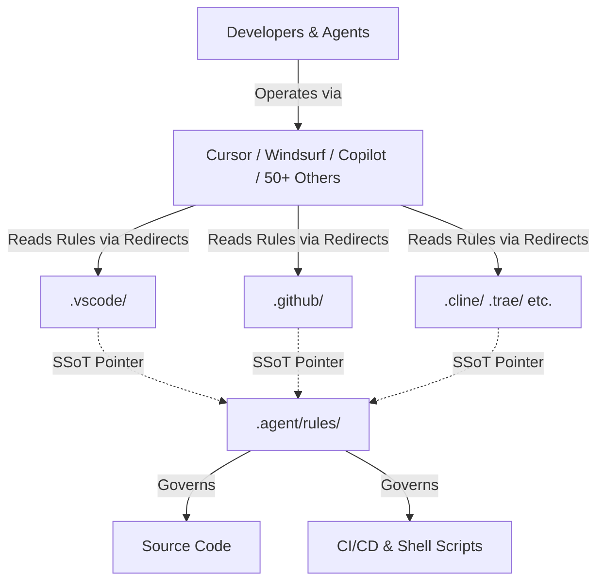

# Snowdream Tech AI IDE Template

[](https://github.com/snowdreamtech/template/actions/workflows/ci.yml)
[](https://github.com/snowdreamtech/template/actions/workflows/cd.yml)
[](https://github.com/snowdreamtech/template/actions/workflows/pages.yml)
[](https://github.com/snowdreamtech/template/actions/workflows/codeql.yml)
[](https://github.com/snowdreamtech/template/actions/workflows/ci.yml)
[](https://github.com/snowdreamtech/template/actions/workflows/ci.yml)
[](https://github.com/snowdreamtech/template/releases/latest)
[](https://opensource.org/license/MIT)
[](https://github.com/snowdreamtech/template/releases/latest)
[](https://github.com/snowdreamtech/template/blob/main/.github/dependabot.yml)
[](https://github.com/pre-commit/pre-commit)
[](https://github.com/snowdreamtech/template)
[](https://github.com/snowdreamtech/template/issues)
[](https://github.com/snowdreamtech/template)

[English](README.md) | [简体中文](README_zh-CN.md)

An enterprise-grade, foundational template designed for multi-AI IDE collaboration. This repository serves as a **Single Source of Truth** for AI agent rules, workflows, and project configurations, supporting over 50 different AI-assisted IDEs with massive multi-language support.

## 🌟 Features

- **Multi-IDE Compatibility**: Out-of-the-box support for Cursor, Windsurf, GitHub Copilot, Cline, Roo Code, Trae, Gemini, Claude Code, and 50+ other AI editors.
- **Unified Rule System**: Centralized rule definitions in `.agent/rules/`. Changes propagate automatically to all supported IDEs via a secure symlink/redirect pattern.
- **80+ Language & Framework Rules**: Pre-configured high-quality rules from Rust, Go, TypeScript, Python to Ansible, Kubernetes, and API design.
- **Smart Workflows (SpecKit)**: Standardized `.agent/workflows/` commands (`speckit.plan`, `speckit.analyze`, `snowdreamtech.init`) that behave consistently across all supported environments.
- **Triple Guarantee Quality**: 100% code purity enforced through Pre-commit and GitHub Actions integrated quality gates.
- **Cross-Platform Ready**: Runs seamlessly on macOS (Homebrew/MacPorts), Linux, and Windows.

## 🏗️ Section 1 — Design & Architecture

### Overview

The Snowdream Tech Template is a foundational scaffold engineered to solve the "N-IDE Fragmentation" problem. It standardizes the development environment, AI agent rules, and automation pipelines across varied platforms and languages.

**Key Capabilities:**

- Provides a **Unified Rule Engine** that governs AI behavior consistently across 50+ IDEs.
- Enforces **Cross-Platform Portability** through dynamically adapting POSIX shell automation.
- Implements a **Triple Guarantee Quality Gate** (IDE, CLI, CI) to prevent regressions.
- Supports **Massive Multi-Language Stacks** with modular onboarding logic.

### Architecture



### Design Principles

- **Single Source of Truth (SSoT)**: All AI rules, commands, and Git hooks live in one place. No duplicated IDE configurations.
- **Cross-Platform Portability**: Heavy automation logic is written in POSIX Shell, with thin wrappers for Windows PowerShell/Batch.
- **Triple Guarantee Quality**: Linting and formatting form an impenetrable wall, enforced at the IDE layer, pre-commit layer, and CI/CD GitHub Actions layer.

### Responsibilities

- **.agent/rules/**: Owns the definitive behavioral logic for AI agents across all supported languages.
- **scripts/**: Owns the cross-platform automation and lifecycle logic.
- **.agent/workflows/**: Owns the interactive AI commands (SpecKit).

---

## 📖 Section 2 — Usage Guide

### Prerequisites

- **Runtime**: Node.js (>= 20.x), Python (>= 3.10.x).
- **Git**: Global git installation required.

### Quick Start

1. **Prerequisites**: [UniRTM](https://github.com/snowdreamtech/UniRTM) is required for global tool and task management.
2. **Initialize**: `unirtm run setup` (bootstraps core tools).
3. **Install**: `unirtm run install` (installs project dependencies).
4. **Verify**: `unirtm run verify` (ensures everything is green).

### Configuration Reference

| Parameter      | Purpose                                                           | Location                |
| :------------- | :---------------------------------------------------------------- | :---------------------- |
| `PROJECT_NAME` | Project identity                                                  | `init-project.sh`       |
| `GITHUB_PROXY` | Network optimization (See [Proxy Usage](#-proxy-usage-scenarios)) | `scripts/lib/common.sh` |
| `VERSION`      | Semantic versioning                                               | `package.json`          |

### File Structure

```text
project-root/
├── .agent/              # 🤖 Canonical AI configuration (The Brain)
│   ├── rules/           # 📏 Unified AI behavioral rules (80+ sets, SSoT)
│   └── workflows/       # 🛠️ Unified commands & AI workflows (SpecKit)
├── .agents/             # 🧩 Shared command sources (Auto-managed symlinks)
├── .github/             # 🐙 GitHub integration & Copilot settings
├── .vscode/             # 💻 Optimized VS Code configurations
└── src/                 # 📦 Your actual application source code
```

---

## 🛠️ Section 3 — Operations Guide

### Pre-deployment Checklist

1. Run `unirtm run verify` to ensure all quality gates are green.
2. Run `unirtm run audit` to verify security compliance.
3. Ensure `CHANGELOG.md` is updated.

### Performance Considerations

- **Linting Speed**: Pre-commit hooks target < 5s by scanning staged files only.
- **CI Throughput**: GitHub Actions use matrix builds for parallel testing across OS types.

### Troubleshooting

- **Problem**: `unirtm run install` fails on Windows.
  - **Diagnosis**: Check if `ExecutionPolicy` allows script execution.
  - **Solution**: Run `Set-ExecutionPolicy -Scope Process -ExecutionPolicy Bypass`.
- **Problem**: Gitleaks detects false positives.
  - **Diagnosis**: Check `.gitleaks.toml` allowlist.
  - **Solution**: Add fingerprint to `.gitleaksignore`.
- **Problem**: Pre-commit hooks fail on macOS after `unirtm run install` with Python errors.
  - **Diagnosis**: Check if the venv exists: `ls .venv/bin/python`.
  - **Solution**: Rebuild the venv: `rm -rf .venv && unirtm run install`.

---

## 🔒 Section 4 — Security Considerations

### Security Model

- **Secret Management**: All secrets must be injected via environment variables or handled by HashiCorp Vault. Never commit `.env` files.
- **Audit Logging**: All critical operations (commits, releases, state changes) are traced via Git and CI logs.
- **Supply Chain**: All CI actions are pinned to exact versions/SHAs.

### Best Practices

| Aspect      | Requirement                  | Implementation                    |
| :---------- | :--------------------------- | :-------------------------------- |
| Secrets     | No plaintext secrets in repo | `gitleaks` enforced at commit     |
| Integrity   | Verify downloads             | SHA-256 validation in `common.sh` |
| Permissions | Non-root execution           | Dockerfile best practices         |

---

## 🧑‍💻 Section 5 — Development Guide

### Code Organization

```text
project-root/
├── .agent/               # AI configuration (Single Source of Truth)
│   ├── rules/            # 88 behavioral rule files for AI agents
│   └── workflows/        # SpecKit slash-command definitions
├── .github/              # GitHub ecosystem (Actions, templates, Dependabot)
│   └── workflows/        # CI/CD pipelines (lint, verify, release, security)
├── .devcontainer/        # DevContainer configuration for reproducible environments
├── docs/                 # Project documentation
│   ├── adr/              # Architecture Decision Records
│   ├── runbooks/         # Operations and recovery runbooks
│   └── glossary.md       # Bilingual term glossary
├── scripts/              # POSIX shell automation (setup, install, verify)
│   └── lib/              # Shared shell library functions
└── .unirtm.toml          # Task orchestration (setup, install, lint, verify, audit)
```

**Naming Conventions**: Rule files use `NN-kebab-case.md` (core rules) or `technology.md`
(language stacks). Workflow files use `namespace.verb.md`. Shell scripts use `kebab-case.sh`.

### Extension Points

1. **Adding Rules**: Create a new `.md` file in `.agent/rules/` and link it in `00-index.md`.
2. **Adding Commands**: Add `.md` files to `.agent/workflows/`.
3. **Adding IDE Support**: Create a redirect folder (e.g., `.myide/`) following the symlink pattern in Rule 03.

### Local Development Setup

```bash
git clone <repo>
cd <repo>
git config core.ignorecase false  # MANDATORY for Mac/Windows
unirtm run setup
unirtm run install
```

### References

- [Full Documentation](docs/index.md)
- [Project Glossary](docs/glossary.md)
- [Conventional Commits](https://www.conventionalcommits.org/)

### 🚀 Proxy Usage Scenarios

The `GITHUB_PROXY` (default: `https://gh-proxy.sn0wdr1am.com/`) is optimized for specific network acceleration scenarios. Misusing it for unsupported protocols (like Git) will result in errors.

| Scenario              | Supported? | Example / Note                                         |
| :-------------------- | :--------- | :----------------------------------------------------- |
| **Release Files**     | ✅ Yes     | `.../releases/download/v1.0/tool.zip`                  |
| **Source Archives**   | ✅ Yes     | `.../archive/master.zip` or `.tar.gz`                  |
| **Direct File Links** | ✅ Yes     | `.../blob/master/filename`                             |
| **Git Clone**         | ❌ **No**  | Do **not** use for `git clone` or `insteadOf` configs. |
| **Project Folders**   | ❌ **No**  | Browsing/cloning via proxy is not supported.           |

> [!IMPORTANT]
> To prevent breaking toolchains (like `unirtm` or `asdf`), this template explicitly disables Git redirection via this proxy. Use it only for direct HTTP downloads in scripts.

## 📄 License

This project is licensed under the **MIT License**.
Copyright (c) 2026-present [SnowdreamTech Inc.](https://github.com/snowdreamtech)
See the [LICENSE](./LICENSE) file for the full license text.

## Star History

[](https://www.star-history.com/?repos=snowdreamtech%2Ftemplate&type=date&legend=top-left)
