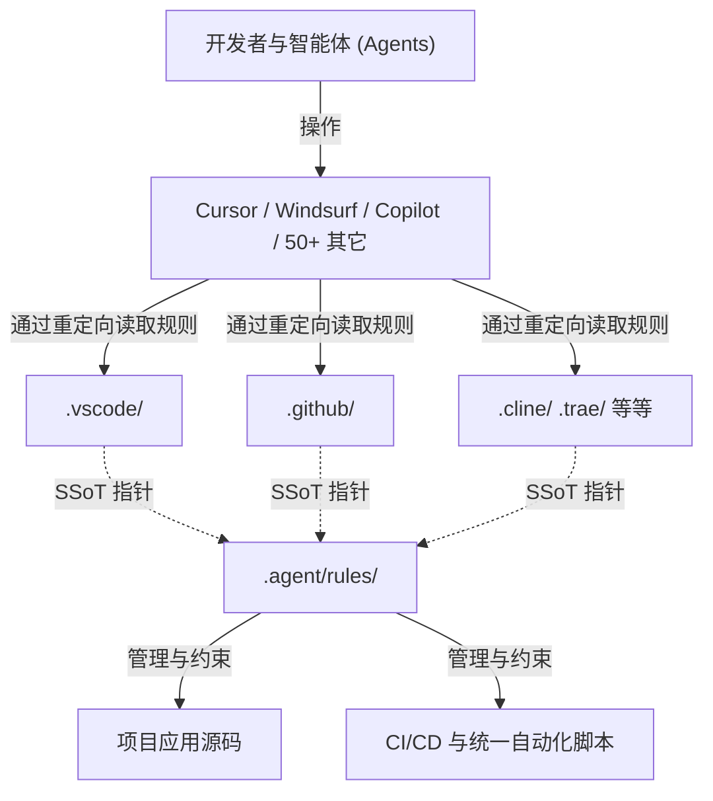

# Snowdream Tech AI IDE 模板

[](https://github.com/snowdreamtech/template/actions/workflows/ci.yml)
[](https://github.com/snowdreamtech/template/actions/workflows/cd.yml)
[](https://github.com/snowdreamtech/template/actions/workflows/pages.yml)
[](https://github.com/snowdreamtech/template/actions/workflows/codeql.yml)
[](https://github.com/snowdreamtech/template/actions/workflows/ci.yml)
[](https://github.com/snowdreamtech/template/actions/workflows/ci.yml)
[](https://github.com/snowdreamtech/template/releases/latest)
[](https://opensource.org/license/MIT)
[](https://github.com/snowdreamtech/template/releases/latest)
[](https://github.com/snowdreamtech/template/blob/main/.github/dependabot.yml)
[](https://github.com/pre-commit/pre-commit)
[](https://github.com/snowdreamtech/template)
[](https://github.com/snowdreamtech/template/issues)
[](https://github.com/snowdreamtech/template)

[English](README.md) | [简体中文](README_zh-CN.md)

一个企业级、为多 AI IDE 协作而设计的基石模板。本项目作为 AI Agent 规则、工作流和项目配置的**单一事实来源 (Single Source of Truth)**，支持超过 50 种不同的 AI 辅助 IDE，并提供海量的多语言支持。

## 🌟 特性

- **多 IDE 兼容性**：开箱即用支持 Cursor、Windsurf、GitHub Copilot、Cline、Roo Code、Trae、Gemini、Claude Code 等 50 多种 AI 编辑器。
- **统一规则系统**：在 `.agent/rules/` 中维护中心化规则定义。在此修改规则通过安全的软链接/重定向模式自动传播到所有支持的 IDE。
- **80+ 语言与框架规则**：预配置的高质量规则，涵盖从 Rust、Go、TypeScript、Python 到 Ansible、Kubernetes 和 API 设计等各个领域。
- **智能工作流 (SpecKit)**：标准化的 `.agent/workflows/`（命令），如 `speckit.plan`、`speckit.analyze` 和 `snowdreamtech.init`，在所有支持的环境中保持一致。
- **三重保证质量**：通过 Pre-commit 和 GitHub Actions 集成门禁检查，确保 100% 的代码纯净。
- **跨平台就绪**：在 macOS (Homebrew/MacPorts)、Linux 和 Windows 上无缝运行。

## 🏗️ 第 1 节 — 设计与架构

### 概览 (Overview)

Snowdream Tech 模板是一个基础脚手架，专为解决“多重 AI IDE 协作产生的配置碎片化”问题而设计。它在各种平台和语言中标准化了开发环境、AI Agent 规则以及自动化流水线。

**核心能力 (Key Capabilities):**

- 提供**统一的规则引擎**，跨 50+ 种 IDE 一致地约束 AI 行为。
- 通过动态适配的 POSIX Shell 自动化脚本，强制保证**跨平台便携性**。
- 实施**三重保证质量门禁**（IDE、CLI、CI），严防代码劣化。
- 支持**大规模多语言技术栈**，并配备模块化的加载逻辑。

### 架构 (Architecture)



### 设计原则

- **唯一事实来源 (SSoT)**: 所有 AI 行为准则、开发脚手架命令和 Git 生态钩子均集中在一处维护，彻底消灭各 IDE 之间的配置孤岛与冗余。
- **跨平台多态性 (Cross-Platform)**: 核心自动化流水线基于原生 POSIX Shell 编写，且强制为 Windows (PowerShell / Batch) 提供对等兼容的轻量级包装层。
- **三重质量护城河 (Triple Guarantee)**: 由 IDE 实时自动修复、Pre-commit 本地强制阻断、以及 CI/CD (GitHub Actions) 远端全量审计，三层联防共同构建 100% 代码纯净度防线。

### 职责分工

- **.agent/rules/**: 拥有跨所有支持语言的 AI Agent 权威行为逻辑。
- **scripts/**: 拥有跨平台自动化和生命周期逻辑。
- **.agent/workflows/**: 拥有交互式 AI 命令 (SpecKit)。

---

## 📖 第 2 节 — 使用指南

### 前置条件

- **运行时**: Node.js (>= 20.x), Python (>= 3.10.x)。
- **Git**: 需要全局安装 git。

### 快速开始

1. **前提条件**：必须安装 [UniRTM](https://github.com/snowdreamtech/UniRTM) 以实现全局工具和任务管理。
2. **初始化**：`unirtm run setup`（引导安装核心工具）。
3. **安装**：`unirtm run install`（同步项目依赖）。
4. **验证**：`unirtm run verify`（确保环境健康）。

### 配置参考

| 参数           | 用途                                       | 位置                    |
| :------------- | :----------------------------------------- | :---------------------- |
| `PROJECT_NAME` | 项目身份                                   | `init-project.sh`       |
| `GITHUB_PROXY` | 网络优化 (见 [代理使用场](#-代理使用场景)) | `scripts/lib/common.sh` |
| `VERSION`      | 语义化版本                                 | `package.json`          |

### 目录结构

```text
project-root/
├── .agent/              # 🤖 权威 AI 配置 (大脑)
│   ├── rules/           # 📏 统一 AI 行为规则 (80+ 套件, SSoT)
│   └── workflows/       # 🛠️ 统一命令与 AI 工作流 (SpecKit)
├── .agents/             # 🧩 共享命令源 (自动管理的软链接)
├── .github/             # 🐙 GitHub 集成与 Copilot 设置
├── .vscode/             # 💻 优化的 VS Code 配置
└── src/                 # 📦 您的实际应用源代码
```

---

## 🛠️ 第 3 节 — 运维指南

### 部署前检查清单

1. 运行 `unirtm run verify` 确保所有质量门禁均为绿色。
2. 运行 `unirtm run audit` 验证安全合规性。
3. 确保 `CHANGELOG.md` 已更新。

### 性能考虑

- **Lint 速度**: Pre-commit 钩子通过仅扫描暂存文件，目标耗时 < 5s。
- **CI 吞吐量**: GitHub Actions 使用矩阵构建在不同操作系统上并行测试。

### 故障排除

- **问题**: `unirtm run install` 在 Windows 上失败。
  - **诊断**: 检查 `ExecutionPolicy` 是否允许脚本执行。
  - **解决方案**: 运行 `Set-ExecutionPolicy -Scope Process -ExecutionPolicy Bypass`。
- **问题**: Gitleaks 检测到误报。
  - **诊断**: 检查 `.gitleaks.toml` 白名单。
  - **解决方案**: 将特征码添加到 `.gitleaksignore`。
- **问题**: `unirtm run install` 后，macOS 上的 Pre-commit 钩子出现 Python 报错。
  - **诊断**: 检查 venv 是否存在：`ls .venv/bin/python`。
  - **解决方案**: 重建 venv：`rm -rf .venv && unirtm run install`。

---

## 🔒 第 4 节 — 安全注意事项

### 安全模型

- **机密管理**: 所有机密必须通过环境变量注入或由 HashiCorp Vault 处理。严禁提交 `.env` 文件。
- **审计日志**: 所有关键操作（提交、发布、状态变更）均通过 Git 和 CI 日志记录。
- **供应链**: 所有 CI Action 均锁定到精确的版本/SHA。

### 最佳实践

| 维度   | 要求             | 实现                          |
| :----- | :--------------- | :---------------------------- |
| 机密   | 仓库中无明文机密 | 提交时强制执行 `gitleaks`     |
| 完整性 | 验证下载内容     | `common.sh` 中的 SHA-256 校验 |
| 权限   | 非 root 执行     | Dockerfile 最佳实践           |

---

## 🧑‍💻 第 5 节 — 开发者指南

### 代码组织 (Code Organization)

```text
project-root/
├── .agent/               # AI 配置（单一事实来源）
│   ├── rules/            # 88 个 AI Agent 行为规则文件
│   └── workflows/        # SpecKit 斜杠命令定义
├── .github/              # GitHub 生态（Actions、模板、Dependabot）
│   └── workflows/        # CI/CD 流水线（lint、verify、release、security）
├── .devcontainer/        # DevContainer 配置，保障可复现的开发环境
├── docs/                 # 项目文档
│   ├── adr/              # 架构决策记录
│   ├── runbooks/         # 运维与恢复手册
│   └── glossary.md       # 中英文对照术语表
├── scripts/              # POSIX Shell 自动化脚本（setup、install、verify）
│   └── lib/              # 共享 Shell 库函数
└── .unirtm.toml          # 任务编排（setup、install、lint、verify、audit）
```

**命名规范**：核心规则文件使用 `NN-短横线命名.md`，语言栈规则使用 `technology.md`，
工作流文件使用 `namespace.verb.md`，Shell 脚本使用 `kebab-case.sh`。

### 扩展点

1. **添加规则**: 在 `.agent/rules/` 中创建新的 `.md` 文件，并在 `00-index.md` 中关联。
2. **添加命令**: 将 `.md` 文件添加到 `.agent/workflows/`。
3. **添加 IDE 支持**: 按照 Rule 03 中的软链接模式创建重定向文件夹（例如 `.myide/`）。

### 本地开发设置

```bash
git clone <repo>
cd <repo>
git config core.ignorecase false  # Mac/Windows 用户必须执行此设置
unirtm run setup
unirtm run install
```

### 参考资料

- [完整文档](docs/index.md)
- [项目术语表](docs/glossary.md)
- [约定式提交](https://www.conventionalcommits.org/)

### 🚀 代理使用场景

`GITHUB_PROXY` (默认: `https://gh-proxy.sn0wdr1am.com/`) 针对特定的网络加速场景进行了优化。在不支持的协议（如 Git）上误用它会导致错误。

| 场景                   | 是否支持      | 示例 / 说明                                    |
| :--------------------- | :------------ | :--------------------------------------------- |
| **Release 文件**       | ✅ 支持       | `.../releases/download/v1.0/tool.zip`          |
| **源码归档 (Archive)** | ✅ 支持       | `.../archive/master.zip` 或 `.tar.gz`          |
| **文件直接链接**       | ✅ 支持       | `.../blob/master/filename`                     |
| **Git Clone**          | ❌ **不支持** | **请勿**用于 `git clone` 或 `insteadOf` 配置。 |
| **项目文件夹**         | ❌ **不支持** | 不支持通过代理进行项目文件夹的浏览或克隆。     |

> [!IMPORTANT]
> 为了防止破坏工具链（如 `unirtm` 或 `asdf`），本模板显式禁用了通过此代理进行的 Git 重定向。请仅在脚本中进行直接 HTTP 下载时使用它。

---

## 📄 许可证

本项目采用 **MIT 许可证** 授权。
版权所有 (c) 2026-现在 [SnowdreamTech Inc.](https://github.com/snowdreamtech)
详见 [LICENSE](./LICENSE) 文件。

## Star History

[](https://www.star-history.com/?repos=snowdreamtech%2Ftemplate&type=date&legend=top-left)
